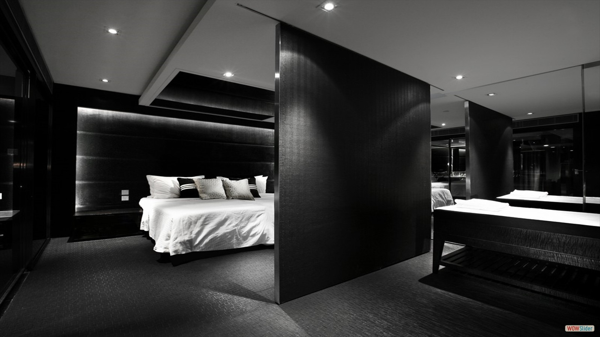
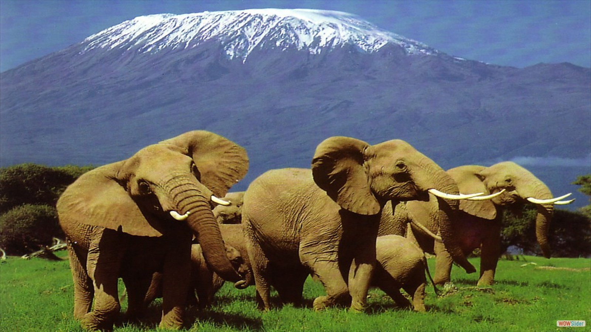
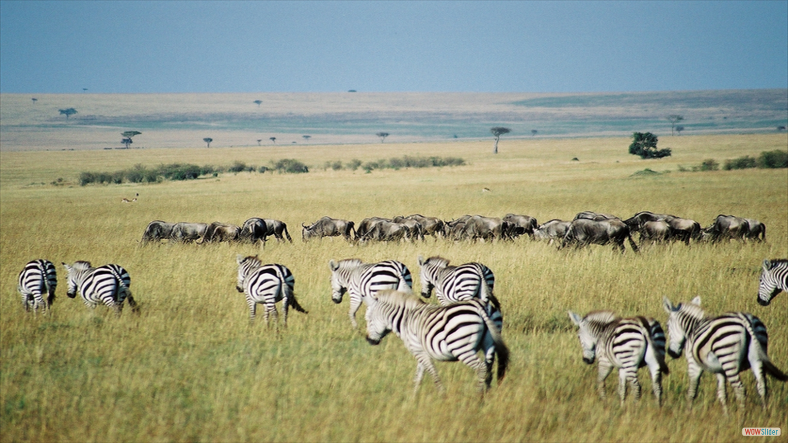
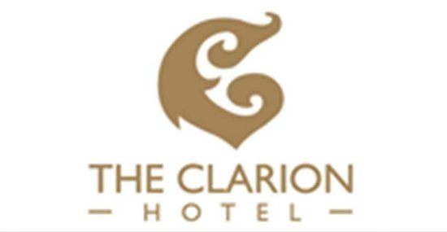

<!DOCTYPE html>
<html lang="en-US" class="no-js">
<head>
	<meta charset="UTF-8">
	<meta name="keywords" content="Century Hospitality Solutions,century,hospitality,solutions,hotels in kenya,kenya,hotels,consultancy in kenya,internship in kenya,kenyatta,jimmy,james kenyatta"/>
	<meta name="viewport" content="width=device-width, initial-scale=1">
	<link rel="profile" href="http://gmpg.org/xfn/11">
	
	 <link rel="stylesheet" href="https://maxcdn.bootstrapcdn.com/bootstrap/3.3.7/css/bootstrap.min.css">
  
  
  
	
        <title>Welcome to Century Hospitality Solutions</title>
<link rel="alternate" type="application/rss+xml" title="My Website &raquo; Feed" href="feed/" />
<link rel="alternate" type="application/rss+xml" title="My Website &raquo; Comments Feed" href="comments/feed/" />
<link rel='stylesheet' id='animateMin-css'  href='css/animate.min.css' type='text/css' media='all' />
<link rel='stylesheet' id='this-style-css'  href='css/style.css' type='text/css' media='all' />
<link rel='stylesheet' id='sitemush-fonts-css'  href='https://fonts.googleapis.com/css?family=Merriweather%3A400%2C700%2C900%2C400italic%2C700italic%2C900italic%7CMontserrat%3A400%2C700%7CInconsolata%3A400&#038;subset=latin%2Clatin-ext' type='text/css' media='all' />
<link rel="stylesheet" type="text/css" href="engine1/style.css" />
	
<link rel='stylesheet' id='genericons-css'  href='css/genericons.css' type='text/css' media='all' />
<link rel='stylesheet' id='sitemush-style-css'  href='css/1-style.css' type='text/css' media='all' />
<!--[if lt IE 10]>
<link rel='stylesheet' id='sitemush-ie-css'  href='css/ie.css' type='text/css' media='all' />
<![endif]-->
<!--[if lt IE 9]>
<link rel='stylesheet' id='sitemush-ie8-css'  href='css/ie8.css' type='text/css' media='all' />
<![endif]-->
<!--[if lt IE 8]>
<link rel='stylesheet' id='sitemush-ie7-css'  href='css/ie7.css' type='text/css' media='all' />
<![endif]-->
<link rel='stylesheet' id='mpce-theme-css'  href='css/theme.css' type='text/css' media='all' />

<link rel='stylesheet' id='mpce-bootstrap-grid-css'  href='css/bootstrap-grid.min.css' type='text/css' media='all' />
<link rel='stylesheet' id='mpce-font-awesome-css'  href='css/font-awesome.min.css' type='text/css' media='all' />

<!--[if lt IE 9]>

<![endif]-->
<link rel='https://api.w.org/' href='szp-json/' />
<link rel="EditURI" type="application/rsd+xml" title="RSD" href="xmlrpc.php?rsd" />
<link rel="wlwmanifest" type="application/wlwmanifest+xml" href="site-inc/wlwmanifest.xml" /> 
<meta name="generator" content="SitePad" />
<link rel="canonical" href="" />
<link rel='shortlink' href='' />
		
		</head>

<body class="home page page-id-6 page-template-default">

	

	
	
			
		
		<header id="masthead" class="site-header" role="banner">

<a href="mailto:info@centuryhospitalitysolutions.com">Have Any Question?</a>

<i class="fa fa-phone"  style=" color: rgb(255, 255, 255);"></i>

<a href="tel:0702619123">+254(0)702619123</a>

<i class="fa fa-envelope"  style=" color: rgb(255, 255, 255);"></i>

<a href="mailto:info@centuryhospitalitysolutions.com">info@centuryhospitalitysolutions</a>

 

<!--

 -->

<a href=""  style=" font-family:verdana; color: rgb(235, 127, 28);font-size:11px;"></img></a>

<i class="fa fa-bars responsive_bar" id="menu-toggle" aria-expanded="false"> </i>  <button class="menu-toggle" id="menu-toggle" aria-expanded="false" aria-controls="site-navigation social-navigation">Menu</button>
	

		<nav id="site-navigation" class="main-navigation" role="navigation" aria-label="Primary Menu">
<ul id="menu-header-menu" class="primary-menu"><li id="menu-item-12" class="home menu-item menu-item-type-post_type menu-item-object-page current-menu-item page_item page-item-6 current_page_item menu-item-12"style="  " ><a href="index.html" style="" >Home</a></li>
<li id="menu-item-13" class="menu-item menu-item-type-post_type menu-item-object-page menu-item-13"style="  " ><a href="about.html"style="  " >About Us</a></li>
<li id="menu-item-14" class="menu-item menu-item-type-post_type menu-item-object-page menu-item-14"style="  " ><a href="/blog"style="  " >Blog</a></li>
<li id="menu-item-15" class="menu-item menu-item-type-post_type menu-item-object-page menu-item-15"style="  " ><a href="contact.html"style="  " >Contact</a></li>
<li id="menu-item-16" class="menu-item menu-item-type-post_type menu-item-object-page menu-item-16"style="  " ><a href="services.html"style="  " >Services</a></li>

</ul>
</nav><!-- .main-navigation -->
	
<!-- .site-header-menu -->

		

		</header><!-- .site-header -->
		
		

		

	<main id="main" class="site-main" role="main">
		
<article id="post-6" class="post-6 page type-page status-publish hentry">

	

			

			

<a href="index.html#xmas"></img></a>
<a href="index.html#xmas">
<h1 style="color:#fff" class="ribbon">
   <strong class="ribbon-content">3 day Maasai Mara "pamoja" safari  </strong>
</h1>
</a>
<h6 style="text-align:center;color:#C70039">
PACKAGES FROM KSHS. 13,499/- PPS (USD175), BASED ON 8PAX IN A VAN.
</h6>

<strong>Christmas twice a year, two times in a month! Let’s go to the Mara then come back for Christmas in the village!</strong>

 

 
	

<!-- Start WOWSlider.com BODY section -->

<ul>
		<li></li>
		<li></li>
		<li></li>
		<li></li>
		<li></li>
		<li></li>
		<li></li>
		<li></li>
		<li></li>
	</ul>

	

		<a href="#" title="Cosy Hotel Bed">1</a>
		<a href="#" title="Maasai Mara Tour Safari">2</a>
		<a href="#" title="Mt. Kilimanjaro View">3</a>
		<a href="#" title="The City View">4</a>
		<a href="#" title="The Early Bird">5</a>
		<a href="#" title="The Maasai Experience">6</a>
		<a href="#" title="The Mara Plains">7</a>
		<a href="#" title="The Promising Clouds">8</a>
		<a href="#" title="The Wildebeest Sundowner">9</a>
	

<a href="http://wowslider.net">jquery slider</a> by WOWSlider.com v8.8

	

<!-- End WOWSlider.com BODY section -->

 

<h6>Bookings</h6>

<a href="form.php">
<button type="button" class="btn btn-default">Hotel Booking</button></a>

<a href="form.php">
<button type="button" class="btn btn-default">Conferencing</button></a>

<a href="form.php">
<button type="button" class="btn btn-default">Safari Booking</button></a>

<h3 id="xmas"  style="text-align:center;color:#7A0728">3 DAYS MASAI MARA ‘PAMOJA’ SAFARI </h3>
<h6 style="text-align:center;color:#7A0728">
PACKAGES FROM KSHS. 13,499/- PPS
(USD175), BASED ON 8PAX IN A VAN.</h6>

<strong>Christmas twice a year! Let’s go to the Mara then come back for Christmas in the village!</strong>

 

  
  <strong> In a raffle, every eighth person,20% off the offer price</strong>

	

	 

<em><blockquote><strong>NOTE:USD per person, double occupancy.Custom designed personal tour. Prices subject to change</strong></blockquote></em>

<a href="form.php"><h4 style="color:white;text-align:center">XMAS OFFER 2017</h4></a>

Everything in “The Mara” is more than just being, it is about life
in the wild. Africa's extraordinary predators,including lions,
leopards, hyenas and wild dogs follow the migrating and mowing
herds along the Mara Plains and the Mara River giving safari
goers excellent chances of seeing a kill in action.Follow the path
and footprints of the annual migration in a private game viewing
vehicle with experienced guides who will take you on several
drives each day. In the evenings, relax in charming tented camps
and lodges and watch the sun set over the plains as you enjoy 

<a href="form.php">Book now </a>

This trip offers unparalleled game viewing with evening relaxation
in excellent quality tented camps and game lodges. Century
Hospitality Solutions offers local support in each region you visit,
we deliver unbeatable value. Enjoy a personalized vacation that
best suits your needs with your friends and family! 
 
Century Hospitality Solutions get you in the company of your
group of friends or family to 3 days Masai Mara National Reserve
get away that maximizes on the vacation opportunity in between
your tight schedule for your joy of the wild in this famous Reserve
known for the famous annual wildebeest migration. You have a
chance of meeting and making new friends as you join a diverse
group of maximum 7 travelers from across in an 8 sitter
customized safari minivan that guarantees everyone a window
seat. While on this tour you have a chance of visiting the Masai
villages for a chance to interact with world famous native Maasai
to explore their rich, attractive and Award winning culture.

<a href="form.php">Book now </a>

<a id="knowMoreButton" class="themecolor smue-btn smue-btn-size-middle smue-btn-rounded" rel=""  style="color:white;">Know More</a>

 

<a href="package.html#itinerary">
<button class="themecolor btn">Itinerary</button></a>

<a href="package.html#package">
<button class="themecolor btn">Package Details</button></a>

<a href="package.html#terms">
<button class="btn themecolor">Terms & conditions</button>
</a>

<h6>payment options </h6>

<a href="form.php">
</img>
 
</img>
 
</img>
</a>

<!--

<h2 style="text-align: center">Our Services</h2>

<h4>Hotel Management Consultants</h4>

At century Hospitality Solutions we are a focused and delivering company that ensures worthy returns for investors on investments. We have a stipulated, practical system that revolves around the employee(team), the employer(owner) and the guest to ensure successful business operations.

Whether it is the guest’s first or fiftieth visit, good management system empowers the hotel service team to deliver on each guest’s individual needs and expectations resulting in an outstanding guest satisfaction.
In addition, good management system optimizes staff task assignments ensuring all issues and requests are resolved in a timely manner. Further, it helps in making insightful decisions from data analysis lowering operating costs while improving guest satisfaction and profit maximization.
Such a system would also help track all of your guest information and interactions in one place. Seamless integration with your property management system (PMS) and central reservation system (CRS) makes taking care of your valued guests easy.
 
	

<a id="knowMoreButton2" class=" themecolor smue-btn smue-btn-size-middle smue-btn-rounded" rel="" >Know More</a>

<h4>Recruitment</h4>

For a while now, Century Hospitality Solutions has offered executive hospitality recruitment services for both employers and job seekers Whether you are searching for your ‘inventor’ or an exciting new opportunity, the professionals at Century Hospitality Solutions are here to help you attain that!

<a href="services.html#moreRecruitment" id="knowMoreButton1" class="themecolor smue-btn smue-btn-size-middle smue-btn-rounded" rel="" >Know More</a>

<h4>Internship</h4>

At Century Hospitality Solutions we are committed to providing both international and regional students and professionals with training, work experience and cultural exchange in a reputable business environment.  We achieve this through forming partnerships with leading educational institutions, Government Departments and leaders in the hospitality industry. 

Students and young professionals are presented with the opportunity to broaden their professional experience. 
The programs are customized to meet the student’s academic and professional needs. Century Hospitality Solutions has a commitment to a high level of personalized support and professional services for clients.  The management and staff of CHS are industry specialists dedicated to the growth and promotion of competent service provision. 
This concept was realized to first, provide students with opportunities to gain the practical experience needed for the absorption in the market, second, to promote consistency in competence service provision and lastly, to provide job opportunities to graduates at the end of their academic career. Century Hospitality Solutions is the first company in East Africa to provide internship programs for participants and young professionals in the region. Company owner, James Kenyatta, is a passionate professional who was a victim of the unavailability of internship programs in the region and with the team at CHS is determined to provide the solution on course.
Century Hospitality Solutions has a structured team to ensure that all key stakeholders and partners are provided with the best services possible.
<a href="services.html#moreIntern">Read more</a>

 

<a id="knowMoreButton3"  class="  themecolor smue-btn smue-btn-size-middle smue-btn-rounded" rel="">Know More</a>

<h4>Tour Safaris </h4>

There’s no better feeling for a guest like connecting with new places, people and experiences through travel and exploration.
From the unique and surprising to the unexpected, get those “unbelievable, unforgettable” moments through a series of ‘Safaris’ in the world of unknown in the East African Region!

With all the, logistics taken care of by Century Hospitality Solutions, you’re at liberty to just be – live the moment, to be inspired, to live a life full of joy as an individual and as a family.
For a while now we’ve considerably developed our tours with one goal in mind; to enable our guests to live A life full of joy.

We connect you to people and places in the region to reveal the true soul of the destinations we visit, the real thing. When you travel with us we take care of all your concerns, so you’re free to just be – be happy, live the moment, be inspired.

<a id="knowMoreButton5"  class="  themecolor smue-btn smue-btn-size-middle smue-btn-rounded" rel="" >Know More</a>

<h4>Events Planning/Team Building</h4>

From innovative and empowering conferencing designed to uniquely deliver your content with a fresh perspective, to exclusive networking events and parties designed to engage, inspire and maximize productivity, the creative Century Hospitality Solutions approach delivers your meeting's story in ways beyond your expectations.

At Century Hospitality Solutions, we believe in providing exceptional value to our clients with superior amenities and services that are included in the overall experience and price.
Century Hospitality Solutions offers you the flexibility to diversify and spread a professional development experience that meets the specific needs of your meeting or convention—from an exceptional presentation to a one- or multi-day program to tours or team-building exercises. Whichever you choose, Century Hospitality Solutions offers unique experiences that engage and energize your group with a fresh perspective.
Come for the meeting and live the experience! The convenience of on-site hotels is an essential part of the CHS Meetings experience. It's an ideal benefit for families and friends, and a great way to drive attendance too. Simply, with your exclusive team come, share the ideas, inspire the world, enjoy the moments and live the experience.

<a id="knowMoreButton4" class=" themecolor smue-btn smue-btn-size-middle smue-btn-rounded" rel="" >Know More</a>

 -->

<h2 style="text-align: center;">A hotel solution is a call away</h2>

Our team is motivated, friendly and focused on enhancing the guest experience through meeting expectations for quality service.

<h2 style="text-align: center;">Our Recent Activities</h2>

We aim to set positive examples in our progressive daily operations. We share our successes and failures, we are reflective. 

<h2 class="goldenColor"><a class="goldenColor" href="#">Team Building</a></h2>

<h2><a class="goldenColor" href="#">Internship</a></h2>

<h2><a class="goldenColor" href="#">Events Planning</a></h2>

<h3 style=""><a class="goldenColor" href="#"><strong>Hotel Management Consultants</strong></a></h3>

<h2><a class="goldenColor" href="#">Tours and Safaris</a></h2>

<a href="#" target="_self" class="smue-btn smue-btn-size-large">View all activities</a>

 

<h2 style="text-align: left;">Want To Contact to us?</h2>

<h4>Our objective is your need</h4>

&nbsp;

<ul>
<li>&#8211; Tours and Safaris</li>
<li>&#8211; Hotel Consultants</li>
<li>&#8211; Internship</li>
<li>&#8211; Recruitment</li>
<li>&#8211; Events Planning</li>
</ul>

<a href="tel:0702619123" target="_self" class="smue-btn smue-btn-rounded smue-btn-size-large">Call Us</a>

<h2 style="text-align: center;">We Work With</h2>

We value and respect everyone who comes through our doors, be they our guests/clients or our team members. We consider their experience and well-being our highest priority. We treat others with dignity and embrace each individual's unique talents

	
<!-- .entry-content -->

</article><!-- #post-## -->

	</main><!-- .site-main -->

<!-- .content-area -->

		
<!-- .site-content -->
		
		
		<footer id="colophon" class="site-footer" role="contentinfo">

<h3>About Us</h3>

<h3>OUR VISION</h3>
To be the first choice for Clients, Colleagues, and Business Partners & be Recognized as unique in the industry for fulfilling our promise “Hospitality at its best “.

<h3>Quick Links</h3>

<ul class="smue-list-type-icon">
<li style="color:rgb(255, 255, 255);"><i  style="color:rgb(255, 255, 255);" class="fa fa-angle-right"></i><a href="about.html">About Us</a>
</li>
<li style="color:rgb(255, 255, 255);"><i  style="color:rgb(255, 255, 255);" class="fa fa-angle-right"></i><a href="services.html">Services</a>
</li>
<li style="color:rgb(255, 255, 255);"><i  style="color:rgb(255, 255, 255);" class="fa fa-angle-right"></i><a href="contact.html">Contact Us</a>
</li>

<li style="color:rgb(255, 255, 255);"><i  style="color:rgb(255, 255, 255);" class="fa fa-angle-right"></i><a href="https://www.facebook.com/meetinyourneed">Social Media</a></li>
</ul>

<h3>Newsletter</h3>

Enter your email to receive our monthly newsletter

<form role="form" class="mpce-cfa-form  newsletter" >

<input type="text" name="EnteryourEmail" id="EnteryourEmail" class="cfa-input required" placeholder="Enter your Email.. * " required="true" />

<input type="hidden" name="cfa_name" value="Contact Form"><input type="hidden" name="cfa_id" value="">

<input type="submit" name="cfa-submit" class="cfa-submit form-submit" value="Subscribe" />

</form>

<h3>Contact</h3>

Please contact or visit us by the address below  

<i class="fa fa-phone"  style=" color: rgb(255, 255, 255);"></i>

+254(0)702619123

<i class="fa fa-clock-o"  style=" color: rgb(255, 255, 255);"></i>

Monday-Monday

8.00 AM &#8211; 10.00 PM

<i class="fa fa-map-marker"  style=" color: rgb(255, 255, 255);"></i>

Agro-house,Moi avenue street,
      P.O BOX 191-00100,
      Nairobi, kenya

<i class="fa fa-envelope"  style=" color: rgb(255, 255, 255);"></i>

info@centuryhospitalitysolutions.com

 <strong>Copyright@2017 Century Hospitality Solutions </strong> 

<strong>Powered by  <a href="mailto:muyaniletina2@gmail.com">Muyani</a></strong>

		</footer><!-- .site-footer -->	
<!-- .site-inner -->

<!-- .site -->

<link rel='stylesheet' id='mpce-cfa-style-css'  href='css/style.min.css' type='text/css' media='all' />

</body>
</html>
